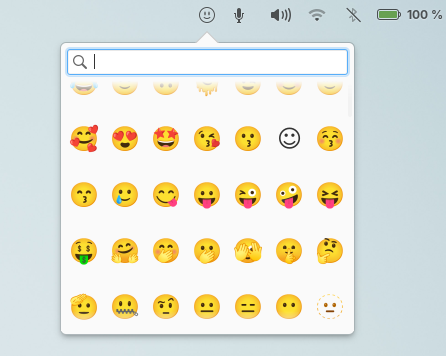

  <h1 align="center">Emoji Picker</h1>
  <h3 align="center">A sleek and fast emoji picker designed for elementary OS. Easily find and copy emojis with an intuitive and minimalist interface<h3>
      

    
        
    

## Building and Installation

You'll need the following dependencies:

    gobject-introspection
    libglib2.0-dev
    libgranite-dev >= 6.0.0
    libnotify-dev
    libwingpanel-dev
    meson >= 0.58.0
    libjson-glib-dev
    valac

Run `meson` to configure the build environment and then `ninja` to build

    meson build --prefix=/usr
    cd build
    ninja

To install, use `ninja install`

    sudo ninja install